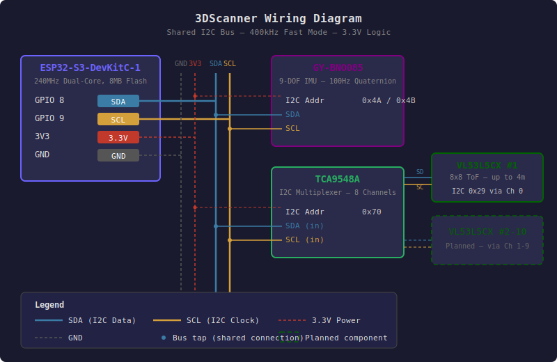
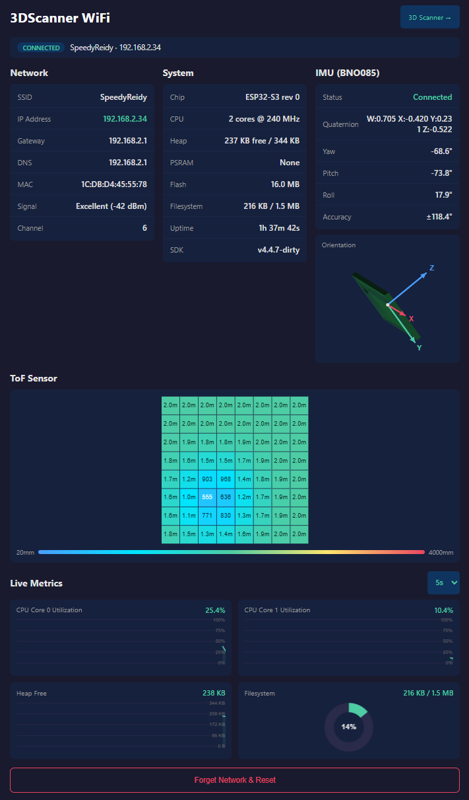
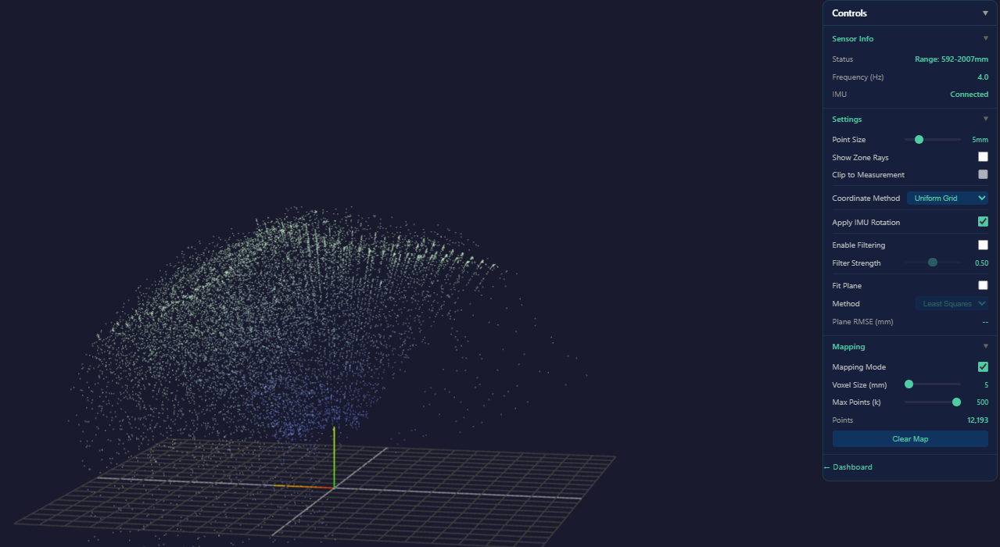

# 3DScanner

An ESP32-S3 powered 3D scanner with a real-time web dashboard, WiFi provisioning captive portal, BNO085 IMU orientation tracking, and VL53L5CX time-of-flight depth sensing.

## Vision

The end goal is a **360-degree 3D scanning rig** using an array of **10 VL53L5CX ToF sensors** arranged in an outward-facing ring, with a single BNO085 IMU for orientation tracking. The sensor ring will capture depth data in all directions simultaneously, combined with IMU orientation, enabling real-time 3D reconstruction of the surrounding room.

**Current status:** The firmware, web dashboard, and single-sensor pipeline are fully working. Additional VL53L5CX sensors are on order and will be integrated as they arrive. The I2C multiplexer (TCA9548A) is already in the hardware stack to support addressing multiple identical sensors on the same bus.

## Hardware

| Component | Qty | Purpose |
|-----------|-----|---------|
| **ESP32-S3-DevKitC-1** | 1 | Main controller — dual-core 240MHz, 8MB flash, WiFi/BLE |
| **BNO085** (GY-BNO085) | 1 | 9-DOF IMU — fused quaternion output at 100Hz via I2C |
| **VL53L5CX** | 1 (10 planned) | 8x8 zone ToF ranging sensor (up to 4m) |
| **TCA9548A** | 1+ | I2C multiplexer for managing multiple sensors with the same address |

Custom 3D-printed enclosure (STL/STEP files in `3dmodels/`).

### Wiring Diagram

<p align="center">
  
</p>

All components share a single I2C bus (GPIO 8 SDA, GPIO 9 SCL) at 400kHz. The TCA9548A multiplexer allows multiple VL53L5CX sensors (all with the same default address 0x29) to coexist on the bus by routing each to a separate channel.

## Features

### WiFi Provisioning
- Boots into AP mode (`3DScanner-XXXX`) when no credentials are saved
- Captive portal auto-opens on Android, iOS, Windows, and Firefox
- Scan and select a network, enter password, device reboots into STA mode
- Supports both DHCP and static IP configuration
- Auto-reconnects on WiFi loss; falls back to AP after 3 failures

### Real-Time Web Dashboard (`/`)

<p align="center">
  
</p>

- **Server-Sent Events** stream all data — no polling
- IMU quaternion at 10Hz with EMA smoothing
- Device metrics at 1Hz (CPU, memory, network, filesystem)
- Per-core CPU utilization with self-calibrating idle counters
- Rolling canvas charts with configurable refresh interval
- **3D orientation visualization** — GY-BNO085 PCB board model with XYZ axis gizmo rotates in real-time with the IMU
- Dark theme, responsive layout (mobile-first, adapts to tablet/desktop)
- Retina-aware canvas rendering, 44px touch targets for mobile

### 3D Room Viewer (`/room`)

<p align="center">
  
</p>
- **Three.js** point cloud rendered in-browser (loaded from CDN, not stored on ESP32)
- Real-time 8x8 ToF distance grid at 4Hz with distance-based coloring
- IMU-driven rotation of board meshes and point cloud at 10Hz
- Two coordinate methods: Uniform Grid (pinhole model) and ST Lookup Table (factory-calibrated)
- Temporal filtering with configurable EMA strength
- Plane fitting: Least Squares and RANSAC with adjustable threshold
- Mapping mode: accumulate points in world coordinates with voxel downsampling
- Zone ray visualization with clip-to-measurement option
- Collapsible control panel with tooltips on all controls

### REST API

| Endpoint | Method | Description |
|----------|--------|-------------|
| `/api/status` | GET | WiFi mode, IP, SSID, RSSI |
| `/api/device` | GET | Chip, CPU, memory, network, IMU, uptime |
| `/api/scan` | GET | Async WiFi scan (non-blocking) |
| `/api/connect` | POST | Save WiFi credentials and reboot |
| `/api/disconnect` | POST | Clear credentials and reboot to AP |
| `/api/events` | SSE | Real-time stream: `tof` (4Hz) + `imu` (10Hz) + `device` (1Hz) |

## Project Structure

```
src/
  main.cpp                  Boot, loop, CPU measurement, IMU polling, auto-reconnect

lib/
  ConfigStore/              NVS credential persistence (Preferences API)
  WiFiManager/              WiFi state machine — AP/STA modes, async scanning
  WebPortal/                AsyncWebServer, SSE streaming, captive portal DNS
  ToFSensor/                VL53L5CX driver wrapper (I2C, 8x8 zone readout)
  SensorRing/               Multi-sensor ring abstraction (TCA9548A mux)

data/                       Web UI (uploaded to LittleFS)
  index.html                Dashboard layout
  style.css                 Dark theme, responsive design
  app.js                    SSE handling, charts, 3D board model + axis visualization
  board.js                  GY-BNO085 PCB mesh (generated from STL)
  room.html                 3D room viewer layout + control panel
  room.js                   Three.js scene, SSE handling, coordinate conversion, mapping
  room.css                  Dark-themed overlay panel + full-viewport canvas

tools/
  stl_to_js.py              Binary STL to JS vertex/face array converter

docs/
  wiring-diagram.svg        Component wiring diagram (I2C bus)

3dmodels/                   Enclosure and component STL/STEP files
photos/                     Component reference photos
```

## Building

### Prerequisites
- [PlatformIO CLI](https://platformio.org/install/cli) or PlatformIO IDE
- ESP32-S3-DevKitC-1 connected via USB

### Flash Firmware + Web UI

```bash
# Build and upload firmware
pio run -t upload

# Build and upload web UI filesystem
pio run -t uploadfs
```

Both steps are needed on first flash. After that, only re-upload what changed.

### Serial Monitor

```bash
pio device monitor
```

All modules use tagged serial output (`[Boot]`, `[WiFi]`, `[IMU]`, `[WebPortal]`, etc.) for easy filtering.

## First-Time Setup

1. Flash firmware and filesystem (see above)
2. Connect to the `3DScanner-XXXX` WiFi network from your phone or laptop
3. A captive portal page should auto-open (or browse to `192.168.4.1`)
4. Select your WiFi network, enter the password, and hit Connect
5. The device reboots and connects to your network
6. Find its IP in your router's client list or serial monitor
7. Open the IP in a browser to see the live dashboard

## Dependencies

Managed automatically by PlatformIO:

| Library | Version | Purpose |
|---------|---------|---------|
| [ESPAsyncWebServer](https://github.com/mathieucarbou/ESPAsyncWebServer) | ^3.6.0 | Async HTTP server + SSE |
| [ArduinoJson](https://github.com/bblanchon/ArduinoJson) | ^7.3.0 | JSON serialization |
| [SparkFun BNO08x](https://github.com/sparkfun/SparkFun_BNO08x_Arduino_Library) | ^1.0.6 | IMU driver |

## License

This project is provided as-is for educational and personal use.
